# Pinterest

1. _**UX:**_
    - Crear cuenta con un formulario o con Facebook o Google e Iniciar sesión.
	- Ir a la página de inicio. 
	- Poder guardar un Pin
	- Guardar una imagen, hacer zoom de la imagen escogida o volver la página de inicio con su tamaño normal.
	- Crear tablero secreto.
	- Crear tablero o seleccionar tablero y sugerencia de nombres para cada tablero. 
    - Editar nombre de la imagen y elegir si es secreto o no.
	- Compartir el tablero en redes sociales (Facebook, Twitter, Whatsapp).
	- Crear un widget.
	- Añadir o elegir una sección.
	- Añadir Pin en la sección creada.
	- Crear Pin cargando una imagen, añadiendo una descripción y enlazándolo con algún sitio web.
	- Buscar resultados similares con la imagen cargada.
	- Ver el sitio web de donde procede el Pin.
	- Buscar imágenes.
    - Agrupación por categoría de imagen.
    - Información adicional sobre la página.
	- Sugerencias del día según mis categorías elegidas.
	- Bandeja de entrada para enviar mensajes, compartir y planificar proyectos.
	- Tipos de usuario: personal o empresarial.
	- Información de seguidores de la cuenta. 
	- Información tableros, pines y probado. 
	- Información de los temas que se están siguiendo. 
	- Guardar ideas creativas. 
	- Visitar centro de asistencia.

2. **UI:** 
    - Diseño de redondeado a las esquinas de cada botón tanto para, los botones de guardar, abrir imagen.
    - Diseño y organización de los Íconos en cada ventana que corresponda (Buscar, fijar, subida de archivos, inicio, menú, perfil, diálogo, más, ayuda, privacidad, zoom, cerrar, foto). 
    - Fondo blanco de cada ventana.
    - El diseño de sombreado al pasar el puntero sobre las imágenes y orden de las mismas.
    - Diseño de sombreado de los nombres sugeridos para el tablero.
    - Diseño (color, tamaño) del input buscar
    - diseño y color del logo.
    - Diseño y orden donde arrastrar una foto.
    - Distribución de las imágenes tanto las de la página de inicio y en resultados similares.
    - Imagen por defecto y diseño de los botones cuando damos en el botón guardar 

    # Imágenes con lo anteriormente dicho:   
    
    _Registro_

    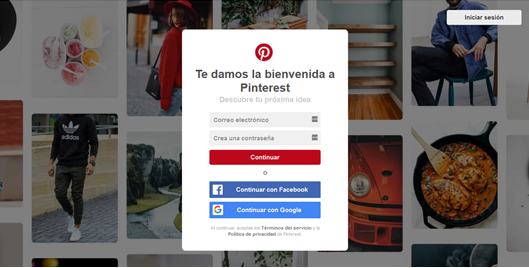

    
    _Inicio de sesión_
    
    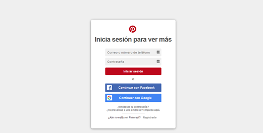

    
    _Pin guardado_
    
    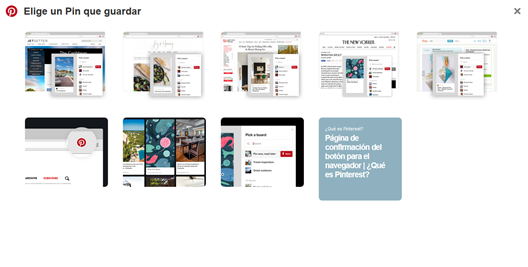

    
    _Guardar una imagen_
    
    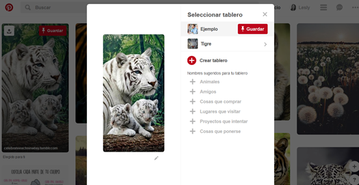

    
    _Crear un tablero_
    
    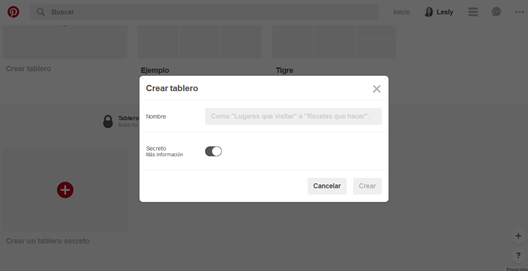

    
    _Compartir en redes sociales_
    
    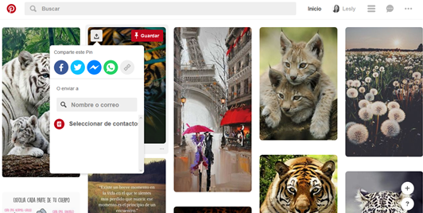

    
    _Crear widgets_
    
    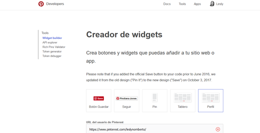

    
    _Añadir sección_
    
    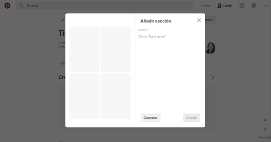

    
    _Seleccionar sección_
    
    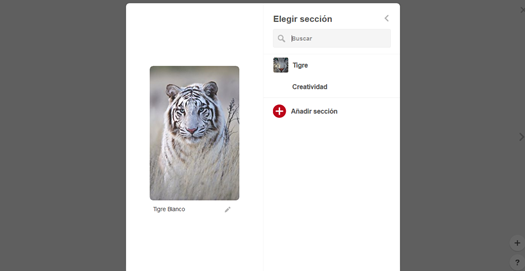

    
    _Crear pin_
    
    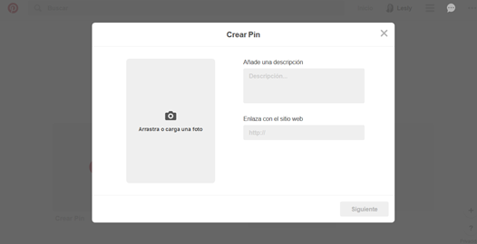

    
    _Resultados similares a la imagen cargada_
    
    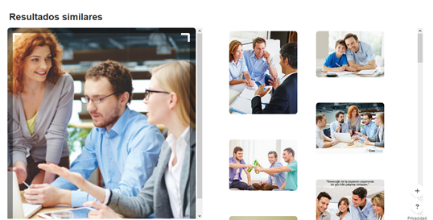

    
    _Procedencia de la imagen_
    
    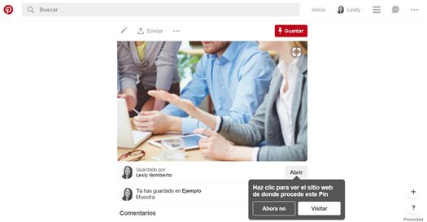

    
    _Cargar una imagen_
    
    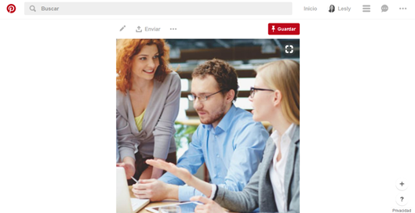

    
    _Recomendaciones_
    
    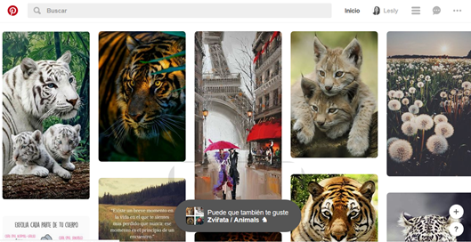

    
    _Información de tableros_
    
    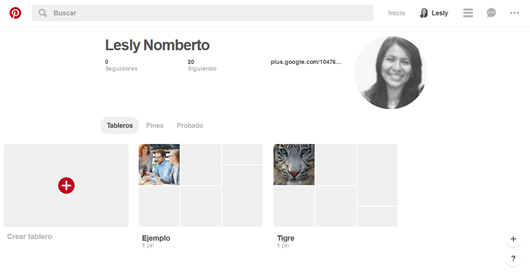

    
    _Información de temas_
    
    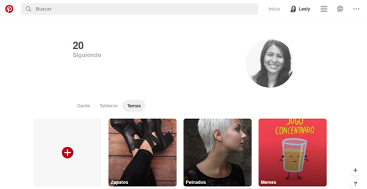

    
    _Guardar modal_
    
    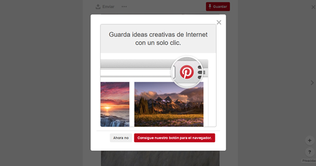

    
    _Botones de ayuda_
    
    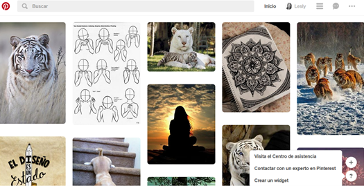

